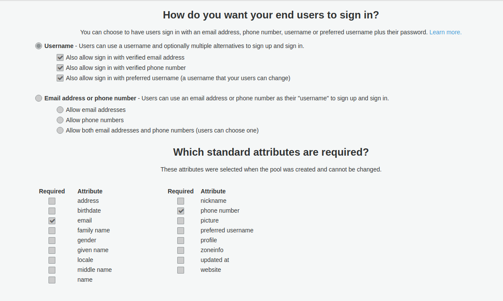

# cognito-node-api

aws-cognito authentication

 
 
### Prerequisites

```
Nodejs
```

### Installing

Open the terminal and execute the commands

- clone repository

```
git clone https://github.com/thiagosimaome/cognito-node-api.git
cd cognito-node-api
```

- install packages

```
npm install
```

## Config aws-cognito

When creating the userpool define several login options, and also set the email and phone fields as required, as shown below



## Config node-api

Get the user pool id and client application id registered in the userpool of the cognito

- path config file

```
  cognito-node-api/config/conf.js

  -- conf.js
  UserPoolId: <USER_POLL_ID_COGNITO>,
  ClientId:   <CLIENT_ID_COGNITO>
```

## Start

```
npm start
```

## Routes

#### POST : /user/create

_Create user_

```
Model : {
  "username": "teste@gmail.com",
  "password": "123456",
  "phone"   : "+5511912365478"
}

```

#### POST : /user/confirm

_Confirme user_

```
Model : {
  "username": "teste@gmail.com",
  "code": "123456"
}

```

#### POST : /user/resend

_Resend Code to User Email_

```
Model : {
  "username": "teste@gmail.com"
}

```

#### POST : /user/signin

_Signin for aws-cognito_

```
Model : {
  "username" : "teste@gmail.com",
  "password" : "123456"
}

```

#### POST : /user/signout

_Signout for aws-cognito_

```
Model : {
  "username" : "teste@gmail.com"
}

```

#### POST : /user/forgot-password

_Resend the code to retrieve the password_

```
Model : {
  "username" : "teste@gmail.com"
}
```

#### POST : /user/forgot-password-confirm

_Resend the code to retrieve the password_

```
Model : {
  "username" : "teste@gmail.com",
  "code"     : "123456",
  "newPassword":"159357"
}
```

## Versioning

We use [SemVer](http://semver.org/) for versioning. For the versions available, see the [(aws cognito node api)](https://github.com/your/project/tags).

## Author

- **Thiago jose de almeida simao** - [Git](https://github.com/thiagosimaome)

## Acknowledgments

- Inspiration
  - in some cases we need some fast authentication mechanism this project serves to meet this need
